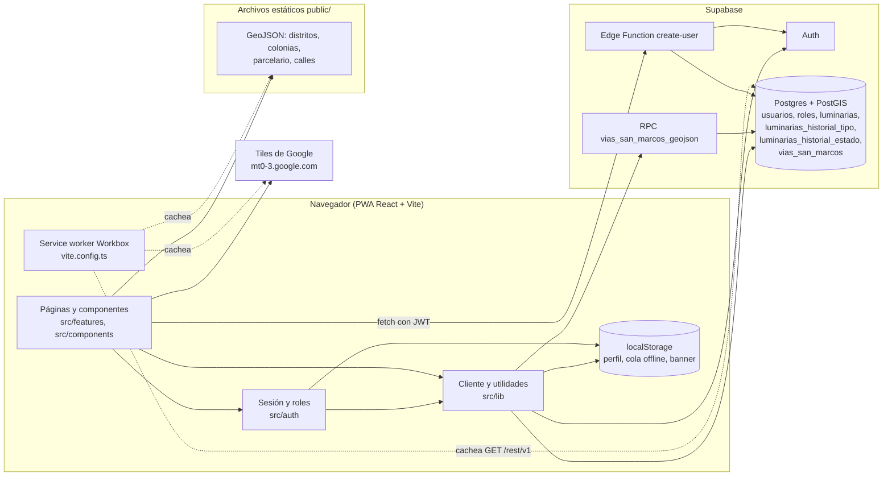
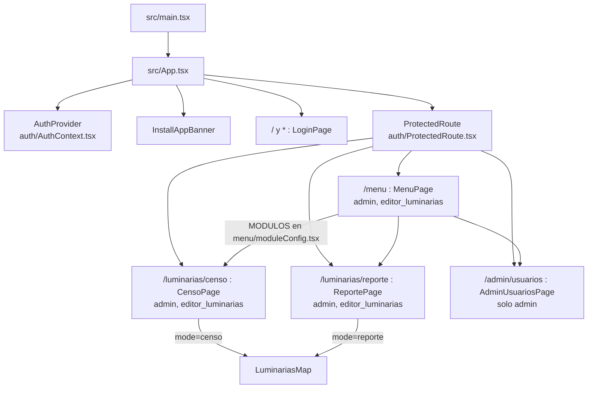
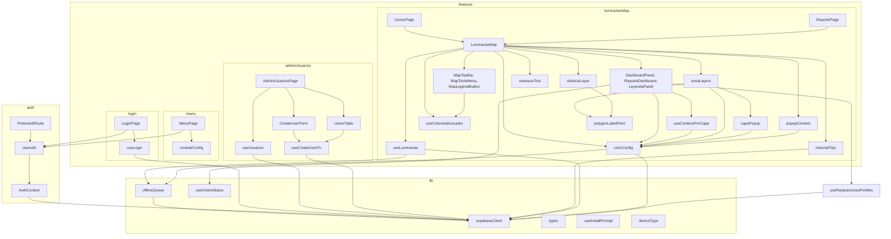
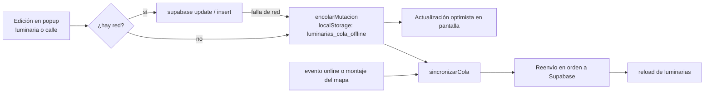
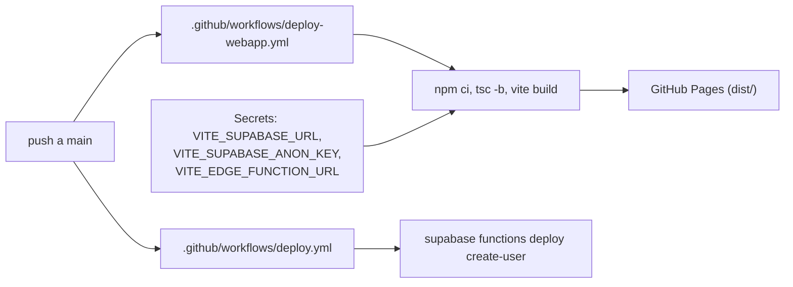

# Grafo del proyecto MAPSSS Luminarias

Mapa de navegación del código. Las flechas significan "depende de" o "llama a".
Generado a partir de los imports reales y de los accesos a datos del código.
Actualizar cuando se agregue un módulo, una ruta, una tabla o una capa del mapa.

## 1. Vista general

## 2. Rutas y control de acceso

Definidas en `src/App.tsx`. Todo cuelga de `BrowserRouter` y `AuthProvider`.

Los roles viven en `ROLES` dentro de `src/lib/types.ts`.
Una ruta nueva exige tres cambios: `App.tsx`, `moduleConfig.tsx` y, si aplica, un rol nuevo en `types.ts`.

## 3. Dependencias entre módulos

`colorConfig.ts` es el nodo central del mapa. Contiene los tipos `MapaConfig` y `CapaExtraConfig`, las configuraciones de censo y reporte, y la definición de cada capa extra.

## 4. Flujo de datos

| Dato | Origen | Quién lo lee | Quién lo escribe |
|---|---|---|---|
| Sesión | Supabase Auth | `auth/AuthContext.tsx`, `login/useLogin.ts` | `login/useLogin.ts` |
| `usuarios` | Postgres | `AuthContext`, `useLogin`, `useUsuarios`, Edge Function | `useUsuarios`, Edge Function |
| `roles` | Postgres | `useLogin`, `useUsuarios` | nadie desde la app |
| `luminarias` | Postgres | `luminariasMap/useLuminarias.ts`, paginado de 1000 | `useLuminarias`, `lib/offlineQueue.ts` |
| `luminarias_historial_tipo` | Postgres, la llena un trigger al cambiar `luminarias.tipo` | `luminariasMap/historialTipo.ts`, botón del popup | solo el trigger `luminarias_registrar_cambio_tipo` |
| `luminarias_historial_estado` | Postgres, la llena un trigger al cambiar `luminarias.estado` | `luminariasMap/useReparacionesPorMes.ts`, dashboard del reporte | solo el trigger `luminarias_registrar_cambio_estado` |
| `vias_san_marcos` | Postgres con PostGIS, vía RPC `vias_san_marcos_geojson` | `colorConfig.ts`, capa Calles | `colorConfig.ts`, `offlineQueue.ts` |
| Distritos | `public/distritos-sss.geojson` | `districtsLayer.ts`, `LeyendaPanel.tsx` | solo lectura |
| Colonias | `public/colonias-san-marcos.geojson` | `colorConfig.ts`, `useColoniasBuscador.ts` | solo lectura |
| Parcelario | `public/parcelario-san-marcos.geojson`, 10 MB, carga diferida | `colorConfig.ts` | solo lectura |
| Alta y baja de usuarios | Edge Function `create-user`, POST y DELETE | `adminUsuarios/useCreateUserFn.ts` | la función usa `service_role` |

El archivo `public/calles-san-marcos.geojson` sigue en el repo, pero la capa Calles ya lee de la tabla `vias_san_marcos`.

### Escritura sin conexión

Tipos de mutación en cola: `update`, `insert` y `viaUpdate`.
Un error real de Supabase descarta la mutación. Un error de red detiene la sincronización y conserva la cola.

## 5. Modos del mapa

| | Censo | Reporte |
|---|---|---|
| Ruta | `/luminarias/censo` | `/luminarias/reporte` |
| Campo editable | `tipo`, más casilla `tasada` | `estado` |
| Columnas pedidas | id, lat, lng, tipo, potencia, tasada, servicio | además estado y distrito |
| Servicio nuevo o antiguo | editable en el popup y obligatorio al añadir | visible en el popup y obligatorio al añadir |

| Dashboard | `DashboardPanel.tsx`: tasadas, tipos y calles | `ReporteDashboard.tsx`: por reparar, reparadas por mes y estados |

Ambos modos comparten `LuminariasMap.tsx`, la barra superior, las herramientas y las capas extra. Toda diferencia entre ellos debe expresarse en `colorConfig.ts`, no con condicionales nuevos en el componente.

## 6. Build y despliegue

Comandos locales: `npm run dev`, `npm run build`, `npm run lint` (oxlint). No hay pruebas automatizadas.

## 7. Dónde tocar según la tarea

| Tarea | Archivos de entrada |
|---|---|
| Nueva capa en el mapa | `luminariasMap/colorConfig.ts`, luego `extraLayers.ts` si requiere comportamiento nuevo |
| Cambiar colores, leyenda o categorías | `luminariasMap/colorConfig.ts` |
| Cambiar el popup de luminaria | `luminariasMap/popupContent.ts` |
| Cambiar el popup de una capa extra | `luminariasMap/capaPopup.ts` |
| Nuevo campo de luminaria | migración en `supabase/migrations/`, `lib/types.ts`, `colorConfig.ts` (columnas), `popupContent.ts`, `useLuminarias.ts` (fila optimista) |
| Cambio de esquema en Supabase | archivo SQL nuevo en `supabase/migrations/`. Se aplica a mano: ningún workflow lo ejecuta |
| Nueva pantalla o módulo | `App.tsx`, `menu/moduleConfig.tsx`, carpeta nueva en `features/` |
| Nuevo rol | `lib/types.ts`, `App.tsx`, `moduleConfig.tsx`, Edge Function |
| Comportamiento offline o caché | `vite.config.ts` (Workbox), `lib/offlineQueue.ts` |
| Gestión de usuarios | `features/adminUsuarios/`, `supabase/functions/create-user/index.ts` |
| Controles y barra del mapa | `MapTopBar.tsx`, `MapToolsMenu.tsx`, `MapLegendButton.tsx`, `leaflet-overrides.css` |
